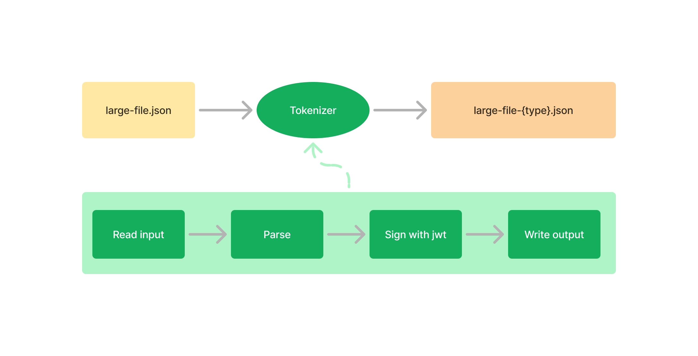
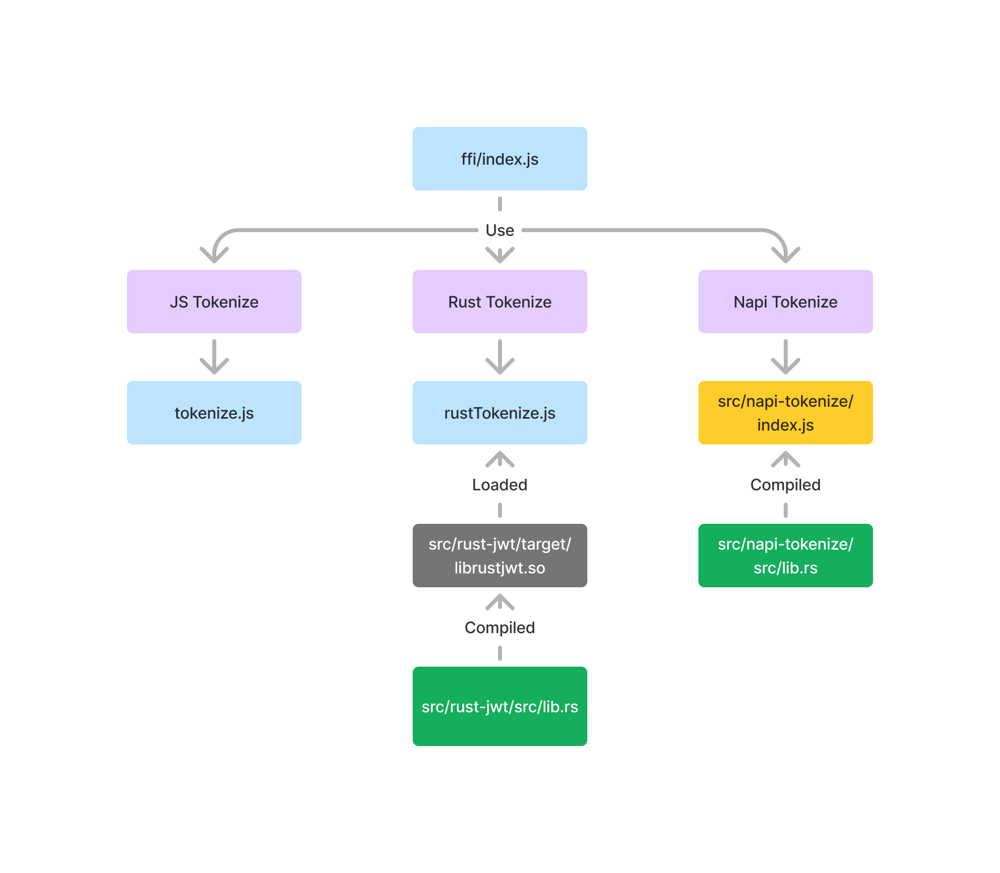

<!-- 
_header: "" 
_paginate: false 
-->

**Faisons _FFI_ du passé et _dérouillons_ notre code**

 ➡️ 

---

### **N**icolas **Remise**

Tech Lead JS/TS/Data

---

   
   
 

---

## Foreign Function Interface

---

## 😑

> C'est quoi ça encore?

---

Les `FFI` permettent à un programme écrit dans un langage de programmation d'appeler des routines ou d'utiliser des services écrits dans un autre langage.

---

> **_EXEMPLE_**
>
> - Appel d'une bibliothèque `C` depuis `Python`
> - Utiliser une fonction `Rust` dans `JS` 😉

---

## 👍

- Interopérabilité 🔌
<!-- Permet l'interaction entre des langages aux caractéristiques complémentaires. -->
- Réutilisation de Code 🧩
<!-- Utilisation de bibliothèques existantes écrites dans d'autres langages. -->
- Optimisation des Performances ⏩
<!-- Utilisation de langages bas niveau pour des opérations critiques en performance. -->

---

## Quand y avoir recours?

---

- Intégration de bibliothèques système ou de bibliothèques tierces
- Amélioration des performances sur des zones critiques
- Utilisation de fonctionnalités spécifiques
- ...

---

Pour résumé, les FFI sont une fonctionnalité de niche puissante.

Non spécifiques à un langage, il s'agit d'une **norme d'interfaçage**.

<!-- > Votez FFI c'est choisir le meilleur outil pour chaque tâche! (Jean-Luc **MergeAFond**) -->

---

---

### JS runtime basé sur V8

- Flexible
- Non bloquant

---

- 🐌 que des langages compilés

👎 pour du _scripting only_

---

- 🌍🧑‍💻 grande communauté
- ⚙️ efficace sur un grand nombre de problématique

👍 pour faire des applications

---

### Mais...

Single-threaded

➡️ ⛔🏅 1st pour les tâches lourdes

---

> Bon, ok... il y a les **worker threads**...

Mais cela reste plus 🐌 par rapport à d'autres (😉)

---

Pour contrer cela 🥊

---

### (True) FFI <!-- plus lent -->

✅ Code compilé chargé comme _shared library_
<!-- .so in linux, .dll in windows, .dylib in macOs -->

❎ mais non spécifique à l'éco-système Node.js

---

### Node.js native addons (_N-API_) <!-- plus rapide -->

✅ C/C++ addon dynamiquement chargé dans le runtime

**N-API**: Application Binary Interface pour Node.js

---

## Pourquoi dérouiller ?

---

## Performance et efficacité 🚈

👍 Vitesse
<!-- Rust est conçu pour être extrêmement rapide, rivalisant avec des langages bas niveau comme C et C++. Il n'utilise pas de ramasse-miettes, ce qui lui permet d'avoir un contrôle précis sur la mémoire et d'éviter les surcharges. -->
👍 Économies de mémoire
<!-- Rust est très économe en mémoire, ce qui est particulièrement avantageux pour les applications avec des contraintes de ressources. -->

---

## Fiabilité et sécurité 🔒

👍 Prévention des erreurs
<!-- Le système de types de Rust est très expressif et permet de détecter de nombreuses erreurs à la compilation, réduisant ainsi les risques de bugs en production. -->
👍 Gestion de la mémoire
<!-- Rust garantit la sécurité de la mémoire en empêchant les déréférencements nuls, les dépassements de tampon et les fuites de mémoire, des problèmes courants dans d'autres langages. -->
👍 Concurrence sûre
<!-- Le système de concurrence de Rust est conçu pour être sûr, permettant d'écrire du code multithread sans craindre les deadlocks ou les data races. -->

---

## Productivité 🏭

👍 Système de typage puissant
<!-- Le système de types de Rust est expressif et permet de modéliser des concepts complexes de manière concise et sûre. -->
👍 Outils de développement
<!-- Rust dispose d'un excellent écosystème d'outils, notamment un compilateur rapide et précis, un gestionnaire de paquets, et une communauté très active. -->
👍 Documentation
<!-- La documentation de Rust est de haute qualité et facile à comprendre, ce qui facilite l'apprentissage et l'utilisation du langage. -->

---

## En prime 💰

👍 Polyvalence
<!-- Rust peut être utilisé pour développer une grande variété d'applications, des systèmes embarqués aux applications web en passant par les jeux vidéo. -->
👍 Interopérabilité
<!-- Rust peut interagir avec du code écrit dans d'autres langages, comme C et C++. -->
👍 Maintien
<!-- Le code Rust est généralement plus facile à maintenir que du code écrit dans d'autres langages, grâce à sa sécurité et à sa clarté. -->

---

> C'est plutôt de bon arguments en faveur de l'implémentation de FFI, non?

## 👼

---

Autre truc cool 😎, Rust peut

- utiliser nativement des lib ou fonctions **C**
- exporter des fonctions utilisables dans du **C**

---

### Zero-cost abstraction :money_with_wings:

> Tu payes ce que tu utilises 😉

---

> A low-level control with high-level ergonomics

**ex:** Une gestion de mémoire sans les tracas qui y sont associés habituellement

---

## 🍰

Des crates existent pour faciliter la création de FFI en Rust pour du JS

-> [napi-rs](https://napi.rs/), [neon](https://neon-rs.dev/), [node-bindgen](https://github.com/infinyon/node-bindgen)

---

<!-- 
_header: ""
_footer: ""
_color: dark
-->

# Let's dev 🧑‍💻

---

## POC subject

1. lire le fichier `.json` volumineux
2. signer un JWT avec chaque donnée
3. écrire un fichier de sortie `.json` contenant les tokens

---

---

3 méthodes:

- JS
- FFI Rust
- FFI Rust powered by **Napi-rs**

---

<!-- header: "" -->

---

### Results 🏁

Les addons sont performants ! 🎉

---

#### Mais... 🤫

Syntaxe plus lourde 🏋️

1 étape supplémentaire de build 🪜

---

## Pour aller plus loin 🚀

---

La communauté Rust évolue

➡️ + en + de tools et de lib 😎

---

Les **ffi/addons** sont une des nombreuses méthodes pouvant apporter une réponse à un besoin de performance sur des _piles techniques "haut-niveau"_

---

### Deno

Intégration native de module WebAssembly

Eco-système Node.js mais sur un moteur V8 en Rust 😉

---

> Pourquoi ne pas franchir le cap et intégrer des microservices de différents langages?

---

> Avoir la bonne réponse technique pour des problèmes souvent mis de côté à cause de la pile technique choisie

---

➡️ [Spin de Fermyon](https://www.fermyon.com/spin)

> Spin is the developer tool for building WebAssembly microservices and web applications

---

---

### Pour résumer 🔖

---

<!-- 
header: ""
footer: ""
-->

## 

**Merci de votre écoute!**
Des questions?

[📁 Ressources](https://github.com/nesimer/talks)
