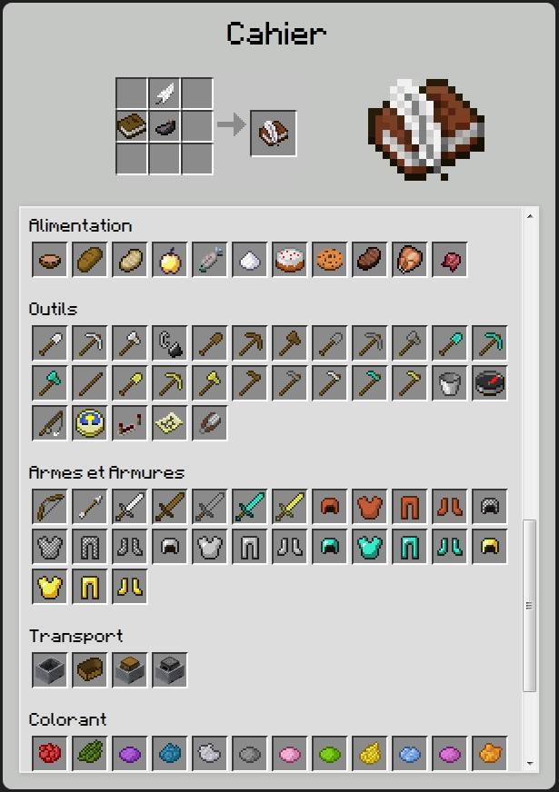
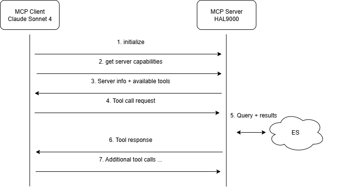
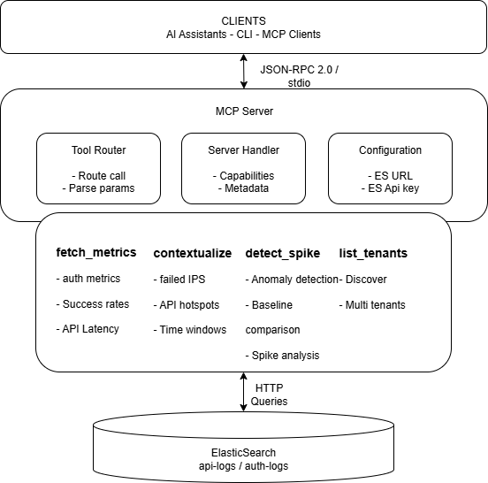

<!-- 
_header: "" 
_paginate: false 
-->

### Forger un cerveau d’acier


Un agent IA MCP en Rust pour analyser vos logs


---

### **N**icolas **Remise**


Responsable Usine Digitale Data


---
<!-- 
_color: white
-->


> Qu'y a-t-il au menu aujourd'hui ? 😋

---

1. Rappels "syntaxiques"
2. Le ❤️ du sujet
3. MCP et Rust 🤝
4. DIY Time 🛠️
5. Et après ? 🤔

---


## MCP, IA, Agent IA, ...

---

## Dico time 📖

> Mieux vaut se répéter que de se tromper

---


#### IA

🎯 Reproduire des capacités humaines via des algorithmes de données

<div class="small">
L'enfant sait reproduire l'écriture sans la lire
</div>

---


#### LLM (Large Language Model)

🧑‍🎓 Modèle d'IA entraîné pour prédire et générer du language naturel

<div class="small">
Une biblio vivante qui a lu tous les livres et qui répond en piochant ce qu'il a "retenu"
</div>

---


#### RAG (Retrieval-Augmented Generation)

🤙 Technique où le LLM cherche des infos dans une base externe avant de répondre

<div class="small">
Le fameux "Appel à un ami" de *Qui veut gagner des millions?*
</div>

---


#### Guardrails

🛡️ Mécanismes de contrôle pour éviter des comportements indésirables

<div class="small">
Comme des glissières de sécurité sur la route, cela n'empêche pas d'avancer mais ça évite de sortir de la route
</div>

---

#### Agent IA

🕵️ Entité construite autour (ou avec) un LLM

Enrichie de modules pour percevoir, raisonner sur la durée et agir

---

<style>
.small {
  font-size: 0.6em;
}
</style>

Jarvis dans Iron Man

<div class="small">

Un agent qui :

- lit tes mails,
- extrait les rendez-vous,
- va interroger ton calendrier,
- réserve une salle si besoin,
- et envoie un mail de confirmation

</div>


---


#### Multi-Agent Systems

🕸️ Plusieurs agents IA qui collaborent ou se challengent pour accomplir une tâche

<div class="small">
L'union fait la force
</div>

🇧🇪

---


#### Model Context Protocol

Protocole ouvert et proposé par **Anthropic**

*25 novembre 2024*

---


à ne pas confondre avec

> ☠️ Master Control Program !

---

Standardiser les échanges entre les LLM et des outils, données ou encore systèmes externes

> Le HTTP de l'IA en gros !

---


#### MCP (Memory, Skills, Planner)

Architecture vulgarisée pour décrire les briques d’un agent IA sous 3 piliers

---
<!-- 
header: ""
footer: ""
-->


> On a assez voyagé dans les rêves, remontons d’un niveau vers la réalité.

---


### Le cas concret

---

#### Contexte

- Une plateforme SaaS multi-tenant (B2B) exposée
- Logs stockés sous Elastic

---

#### Problématique

Lors d'une journée normale :

- trafic stable
- auth usuelles
- volumes call API conformes

---

> Et soudain 💥

En 15min:

- taux d'échec auth ↗️
- latence API ↗️

---

> Rien ne prouve une compromission

C’est un signal faible compatible avec :

- du credential stuffing opportuniste,
- de l’énumération d’utilisateurs,
- un bot qui teste les limites de rate-limit.

---

Afin de réduire le **MTTD/MTTR***, on va:

Automatiser l'analyse et la synthèse d'un rapport actionable via un agent

> Rien que ça 😆

<div class="small">
*Mean Time To Detect et Mean Time To Repair/Respond/Recover
</div>

---

Objectif de l'agent 🏅

- Analyser et contextualiser
- Rapporter
- Expliquer
- Intéropérer

---


### MCP et Rust

---

#### Memory, Skills, Planner

> Retour sur la théorie des 3 piliers

---

###### Memory

Référence à la mémoire de l'agent

Stocke l'historique des échanges pour éviter de repartir à 0

---

###### Skills

Ensemble des compétences que l'agent peut mobiliser

Fonctions concrètes (ex: API ou script)

---

###### Planner

La stratégie

C'est la partie qui organise et décide quelles compétences doivent être utilisées et dans quel ordre

C'est le LLM qui occupe ce rôle

Lie les 2 autres piliers

---

```ascii
┌──────────────────┐
││ LLM │  Planner  │ (Avec elicitation)
│└─────┘           │ 
└───────┬─────▲────┘
        │     │     
┌───────▼─────┼────┐
││ MCP │  Memory   │ (Mémoire optionnelle)
│└─────┘           │
│         Skills   │
└──────────────────┘
```

---

#### MCP in the tech world

---

Normalise les échanges **JSON-RPC 2.0** entre un *host*, un *client* et un *server*

---

Expose 3 features: les **fonctions**, les **ressources** et les **prompts**

---

Supporte plusieurs typologies de transports différentes: `stdio` (proc local) et `Streamable HTTP`

---

Permet le **sampling**

*= demander au client d’appeler un LLM pour générer un message (sans clé d'api)*

et l'**elicitation**

*= demander au client de poser une question à l’utilisateur et de remonter une réponse structurée*

---

#### Pourquoi Rust ?


---

⚡ Performance native

Sécurité mémoire 🔒

🧵 Concurrence efficace

Interopérabilité 🔗

📦 Ecosystème moderne

Fiabilité long terme 🛡️

---


---

`modelcontextprotocol.io` regroupe **SDK** et **docs** sur la mise en oeuvre de MCP

🎁 par chance **1** SDK existe pour l'écosystème Rust:

[rust-sdk](https://github.com/modelcontextprotocol/rust-sdk/)

---

Ce sdk expose 2 crates:

- rmcp
- rmcp-macros

---

Et les seules dependencies majeures requises sont 🥳 :

- [tokio](https://github.com/tokio-rs/tokio)
- [serde](https://github.com/serde-rs/serde)

---

### Macros good-to-know

```rust
#[tool] définit un tool dans un tool_router
#[tool_router] groupe et prepare les tools à exposer
#[tool_handler] presente l'exposition du server MCP

#[prompt] définit une commande prompt
...
```

---

### Features

Transport paramétrable, type de developpement, etc...

```toml
rmcp = { version = "...", features = [ "server", "transport-stdio", "transport-http", "client", ... ] }
```

---

### Validation des données

schemars & serde

```rust
#[derive(Serialize, Deserialize, schemars::JsonSchema)]
pub struct Example {
  /// The tenant identifier to analyze
  #[schemars(description = "the tenant to fetch metrics for", length(min = 1, max = 100))]
  pub tenant: String,
  /// Start time in ISO8601/RFC3339 format
  #[schemars(description = "the start time (ISO8601/RFC3339)", regex(pattern = r"
^(?:19|20)\d{2}-...$"))]
  pub from: String,
}
```

---

#### Suivi

Intégration de `tracing` et `tracing-subscriber`

---



#### Dev Todolist

---

##### Ressources

📩

- 2 index (auth-logs et api-logs)
- 1 mois de données

📨

- résultats des mesures

---

##### Actions

1. `fetch_metrics`
2. `detect_spike`
3. `contextualize`
4. `list_tenants`

---

```rust
function fetch_metrics(request: FetchMetricsRequest) -> FetchMetricsResponse

struct FetchMetricsRequest:
    tenant: String          // ID du tenant
    from: String           // Heure de début (ISO8601/RFC3339)
    to: String             // Heure de fin (ISO8601/RFC3339)

struct FetchMetricsResponse:
    metrics: Metrics       // Métriques calculées (auth rate, API latency, etc.)
```

Calcule les métriques d'authentification incluant les tentatives totales, taux de succès/échec, latence 95e percentile, et requêtes par seconde

---

```rust
function detect_spike(request: DetectSpikeRequest) -> DetectSpikeResponse

struct DetectSpikeRequest:
    from: Optional<String>                    // Début période courante (défaut: now - window)
    to: Optional<String>                      // Fin période courante (défaut: now)
    window: Optional<String>                  // Taille fenêtre ('15m', '1h', défaut: '15m')
    threshold_ratio: Optional<Float>          // Seuil général (défaut: 1.5)
    threshold_fail_rate_ratio: Optional<Float>    // Seuil taux échec auth (défaut: 1.5)
    threshold_p95_ratio: Optional<Float>          // Seuil latence p95 (défaut: 1.5)
    threshold_error_rate_ratio: Optional<Float>   // Seuil taux erreur API (défaut: 1.5)
    threshold_rps_ratio: Optional<Float>          // Seuil req/sec (défaut: 1.5)

struct DetectSpikeResponse:
    results: SpikeResult   // Résultats de détection d'anomalies
```

---

 Effectue la détection d'anomalies en comparant les métriques actuelles contre une période de référence pour identifier des pics suspects dans les taux d'échec, latence, erreurs API, et RPS

---

```rust
function contextualize(request: ContextualizeRequest) -> ContextualizeResponse

struct ContextualizeRequest:
    tenant: String         // ID du tenant à analyser
    from: String          // Heure de début (ISO8601/RFC3339) 
    to: String            // Heure de fin (ISO8601/RFC3339)
    window: Optional<String> // Fenêtre temporelle ('15m', '1h', '2d')

struct ContextualizeResponse:
    contextualization: Contextualization  // Contexte de sécurité détaillé
```

Fournit un contexte de sécurité détaillé incluant les top IP avec échecs d'authentification et les endpoints API les plus actifs avec métriques de performance

---

```rust
function list_tenants() -> ListTenantsResponse

struct ListTenantsResponse:
    tenants: List<String>  // Liste des IDs de tenants découverts
```

Découvre tous les IDs de tenants uniques présents dans les indices Elasticsearch via une agrégation sur le champ tenant_id

---

##### Transports & Déploiements

Local: `stdio` (Le client exec le binaire directement)

Prod/remote: `Streamable HTTP`

---

#### Sécurité / multi-tenant

Isolation par tenant

Input validation via JSON Schema (`serde + schemars`)

[Optionnel] Observabilité via `tracing`

---

> Et après il ne faudra plus que l'intégrer à notre client 😉

---


### Code & demo time 🥳 💻

---

### Usage - Claude Desktop

```json
{
  "mcpServers": {
    "hal9000": {
      "command": "[path du binaire]",
      "args": ["--report-dir", "[path du dir de report]"],
      "env": {
        "ES_URL": "https://elastic.example.com:9243",
        "ES_API_KEY": "xxxxx"
      }
    }
  }
}
```

---

### Usage - VSCode

```json
{
  "servers": {
    "hal9000" :{
      "type": "stdio",
      "command": "[path du binaire]",
      "args": ["--report-dir", "[path du dir de report]"],
      "env": {
        "ES_URL": "https://elastic.example.com:9243",
        "ES_API_KEY": "xxxxx"
      }
    }
  }
}
```

---

#### 📁 Point d'Entrée & Configuration

`main.rs` + `config.rs`

---

## Point d'entrée principal

```rust
#[tokio::main]
async fn main() -> anyhow::Result<()> {
    // 1. Setup logging structuré (tracing)
    tracing_subscriber::fmt().with_env_filter(...).init();
    
    // 2. Parse configuration (CLI + env vars)
    let cfg = Config::parse();
    
    // 3. Créer et démarrer serveur MCP
    let server = HAL9000::new(cfg)
        .serve(stdio())  // Transport MCP stdio
        .await?;
    
    // 4. Attendre shutdown graceful
    server.waiting().await?;
}
```

---

#### Configuration flexible

```rust
#[derive(Parser, JsonSchema)]
pub struct Config {
    #[arg(long, default_value = "http://localhost:9200", env = "ES_URL")]
    pub es_url: String,
    
    #[arg(long, env = "ES_APIKEY", hide_env_values = true)]
    pub es_api_key: String,
}
```

**Multi-source**: CLI args override env vars + validation automatique

---

#### 📊 Types & Erreurs

`types.rs` + `errors.rs`

---

#### Types centraux pour l'analyse

```rust
/// Métriques agrégées multi-sources
#[derive(Serialize, Deserialize, JsonSchema)]
pub struct AggregateMetrics {
    pub total_auth: u64,        // Tentatives authentification
    pub fail_rate: f64,         // Taux échec (0.0-1.0)
    pub p95_latency: f64,       // Latence 95e percentile
    pub api_error_rate: f64,    // Taux erreur API
    pub rps: f64,              // Requêtes par seconde
}

/// Signal détection de spike
#[derive(Serialize, Deserialize, JsonSchema)]
pub struct SpikeSignal {
    pub metric: String,         // "auth.fail_rate"
    pub baseline: f64,         // Valeur référence
    pub current: f64,          // Valeur courante
    pub ratio: f64,            // current/baseline
    pub suspicious: bool,      // Anomalie détectée?
}
```

---

##### Gestion d'erreurs structurée

```rust
#[derive(Error, Debug)]
pub enum AgentError {
    #[error("HTTP request error: {0}")]
    Reqwest(#[from] reqwest::Error),  // Auto-conversion
    
    #[error("Elasticsearch error: {0}")]
    Elasticsearch(String),
}
```

**Pattern**: Types sûrs + conversions automatiques + propagation propre

---

#### 🎯 Serveur MCP Principal

`server.rs`

---

#### Cœur du serveur avec 4 outils MCP

```rust
#[derive(Debug, Clone)]
pub struct HAL9000 {
    tool_router: ToolRouter<Self>,  // Router MCP automatique
    cfg: Config,                    // Configuration partagée
}

#[tool_router]
impl HAL9000 {
    #[tool(name = "fetch_metrics", 
           description = "Calculate authentication and API metrics")]
    async fn fetch_metrics(&self, Parameters(request): Parameters<FetchMetricsRequest>)
        -> Result<Json<FetchMetricsResponse>, String> {
        
        let metrics = tools::fetch_metrics::process(&self.cfg, &Client::new(), request)
            .await.context("Failed to fetch metrics")?;
        Ok(Json(metrics))
    }
    
    // + 3 autres outils: list_tenants, contextualize, detect_spike
}
```

---

#### Métadonnées MCP

```rust
fn get_info(&self) -> ServerInfo {
    ServerInfo {
        capabilities: ServerCapabilities::builder().enable_tools().build(),
        instructions: Some("HAL 9000 - Security analysis for multi-tenant logs")
    }
}
```

**Pattern**: Séparation server (interface) ↔ tools (logique métier)

---

#### 🔍 Couche Elasticsearch

`es/mod.rs`

---

#### Interface unifiée pour toutes interactions ES

```rust
/// Requêtes parallèles optimisées
pub async fn snapshot_metrics(
    client: &Client, es_url: &str, from: &str, to: &str, auth: &Option<String>
) -> Result<AggregateMetrics> {
    
    // Parallélisation pour performance
    let (total_auth, failures, p95_latency, api_errors, request_count) = 
        tokio::try_join!(
            count_auth_attempts(client, es_url, from, to, auth),
            count_auth_failures(client, es_url, from, to, auth), 
            get_p95_latency(client, es_url, from, to, auth),
            count_api_errors(client, es_url, from, to, auth),
            count_total_requests(client, es_url, from, to, auth)
        )?;
    
    // Calculs des rates et métriques dérivées
    let fail_rate = failures as f64 / total_auth.max(1) as f64;
    let error_rate = api_errors as f64 / request_count.max(1) as f64;
    let rps = calculate_rps(request_count, from, to);
    
    Ok(AggregateMetrics { total_auth, fail_rate, p95_latency, error_rate, rps })
}
```

#### Top IPs malveillantes

```rust
pub async fn get_top_failure_ips(...) -> Result<CountsAndIps> {
    let query = json!({
        "aggs": {
            "failure_ips": {
                "terms": { "field": "ip.keyword", "size": 10 },
                "aggs": { "failure_count": { "value_count": { "field": "ip" } } }
            }
        }
    });
    // Parse & return structured data
}
```

---

#### 📊 Outil: Fetch Metrics

`tools/fetch_metrics.rs`

---

###### Calcul métriques d'authentification & API

```rust
pub async fn process(cfg: &Config, client: &Client, input: FetchMetricsRequest) 
    -> Result<FetchMetricsResponse> {
    // 1. Validation temporelle
    let (from_dt, to_dt) = parse_time_range(&input.from, &input.to)?;
    let window_secs = (to_dt - from_dt).num_seconds().max(1) as f64;
    
    // 2. Métriques d'authentification
    let total_auth = es::count_by_tenant(client, &cfg.es_url, &input.tenant, &from_dt, &to_dt, false, &api_key).await?;
    let total_failures = es::count_by_tenant(client, &cfg.es_url, &input.tenant, &from_dt, &to_dt, true, &api_key).await?;
    let (fail_rate, success_rate) = calculate_rates(total_auth, total_failures);
    
    // 3. Métriques API
    let (p95_latency, api_count) = es::api_percentiles_and_count(client, &cfg.es_url, &input.tenant, &from_dt, &to_dt, &api_key).await?;
    let rps = (api_count as f64) / window_secs;
    
    // 4. Réponse
    Ok(FetchMetricsResponse {
        metrics: Metrics {
            tenant: input.tenant,
            window: format!("{}..{}", input.from, input.to),
            total_auth,
            fail_rate,
            success_rate,
            p95_latency,
            rps,
        }
    })
}
```

---

**Usage**: Fetch les différentes métriques voulues

---

#### 🚨 Outil: Detect Spike

`tools/detect_spike.rs`

---

###### Détection d'anomalies baseline vs. courant

```rust
pub async fn process(cfg: &Config, client: &Client, input: DetectSpikeRequest) 
    -> Result<DetectSpikeResponse> {
    // 1. Configuration des paramètres
    let window = input.window.unwrap_or("15m");
    let window_ms = parse_interval_ms(&window)?;
    let now = Utc::now();
    // 2. Calcul des périodes temporelles
    let (cur_from, cur_to) = match (input.from, input.to) {
        (Some(f), Some(t)) => (f, t),
        _ => (now - window, now)  // période par défaut
    };
    let cur_width = cur_to_dt - cur_from_dt;
    let (base_from, base_to) = (cur_from_dt - cur_width, cur_from_dt);  // période baseline
    // 3. Récupération des métriques
    let mc = es::snapshot_metrics(client, &cfg.es_url, &cur_from, &cur_to, &api_key).await
        .unwrap_or_default();  // métriques période courante
    let mb = es::snapshot_metrics(client, &cfg.es_url, &base_from, &base_to, &api_key).await
        .unwrap_or_default();  // métriques période baseline
    // 4. Configuration des seuils
    let default_th = input.threshold_ratio.unwrap_or(1.5);
    let (th_fail, th_p95, th_err, th_rps) = extract_thresholds(input, default_th);    
    // 5. Génération des signaux de spike
    let signals = vec![
        mk_signal("auth.fail_rate", mb.fail_rate, mc.fail_rate, th_fail),
        mk_signal("api.p95_latency", mb.p95_latency, mc.p95_latency, th_p95),
        mk_signal("api.error_rate", mb.api_error_rate, mc.api_error_rate, th_err),
        mk_signal("api.rps", mb.rps, mc.rps, th_rps),
    ];
    // 6. Construction de la réponse
    Ok(DetectSpikeResponse {
        results: SpikeResult { current, baseline, metrics_current: mc, metrics_baseline: mb, signals }
    })
}
```

---

**Algorithme**: ratio = current/baseline, suspicious = ratio > threshold

---

#### 🔍 Outil: Contextualize

`tools/contextualize.rs`

---

###### Analyse contextuelle multi-dimensionnelle

```rust
pub async fn process(cfg: &Config, client: &Client, input: ContextualizeRequest) 
    -> Result<ContextualizeResponse> {
    // 1. Configuration
    let window = input.window.unwrap_or("15m");
    let window_ms = parse_interval_ms(&window)?;
    let top_n = 5;  // nombre de résultats top
    // 2. Analyse des IPs avec échecs d'authentification
    let auth_config = es::AuthFailedIpsConfig {
        es_url: &cfg.es_url,
        tenant: &input.tenant,
        from: &input.from,
        to: &input.to,
        window: &window,
        window_ms,
        top_n,
        auth: &api_key,
    };
    let (overall_ips, by_window) = es::fetch_auth_failed_ips_windowed(client, auth_config).await
        .unwrap_or_default();
    // 3. Analyse des endpoints API les plus actifs
    let hot_endpoints = es::fetch_api_endpoints(client, &cfg.es_url, &input.tenant, &input.from, &input.to, top_n, &api_key).await
        .unwrap_or_default();
    // 4. Réponse
    Ok(ContextualizeResponse {
        contextualization: Contextualization {
            tenant: input.tenant,
            range: RangeSpec { from: input.from, to: input.to },
            window,
            top_failed_ips_overall: overall_ips,
            top_failed_ips_windowed: by_window,
            hot_endpoints,
        }
    })
}
```

---

##### Intelligence actionnable

```json
{
  "top_failure_ips": [{"key": "192.168.1.100", "count": 450}],  // → Block IP
  "hot_endpoints": [{"endpoint": "/api/login", "error_rate": 0.80}],  // → Under attack
  "windowed_ips": [{"window": "10:15-10:30", "escalation": true}]  // → Attack escalation
}
```

---

#### 🏢 Outil: List Tenants

`tools/list_tenants.rs`

---

###### Découverte automatique des tenants

```rust
/// Simple mais essentiel pour énumération
pub async fn process(cfg: &Config, client: &Client) -> Result<ListTenantsResponse> {
    // 1. Récupération des tenant IDs depuis Elasticsearch
    let tenants = crate::es::fetch_tenant_ids(client, &cfg.es_url, &cfg.es_api_key, None).await?;
    
    // 2. Réponse
    Ok(ListTenantsResponse { tenants })
}
```

---

**Usage typique**: Base pour analyser tous les tenants en boucle

---

#### 🏗️ Architecture Globale

---



---



---

### **Performance & Concurrence**

```rust
// 1. Requêtes parallèles
let (metric1, metric2, metric3) = tokio::try_join!(...);

// 2. Error handling structuré
Result<T, AgentError> → anyhow → String (MCP)

// 3. Types sûrs end-to-end
Request → Validation → ES Query → Parse → Response

// 4. Configuration flexible  
CLI args + env vars + defaults + validation
```

---


### Pour aller plus loin

---

- **Connection pooling**: Arc\<Client\> partagé
- **Caching**: Redis/in-memory avec TTL
- **ML Integration**: Isolation Forest, LSTM, AutoML
- **Multi-transport MCP**: HTTP, SSE
- **Streaming**: Real-time analytics via MCP resources

---

#### Scénario: Détection d'Attaque Automatisée

---

```mermaid
User: "Y a-t-il des anomalies sur nos tenants?"
  ↓
Claude → HAL9000: list_tenants()
  ↓  
HAL9000: ["acme", "bravo", "charlie"]
  ↓
Claude → HAL9000: fetch_metrics(tenant="acme", last_hour)
  ↓
HAL9000: {fail_rate: 0.60, p95_latency: 245ms} ⚠️ SUSPECT
  ↓  
Claude → HAL9000: contextualize(tenant="acme", window="15m")
  ↓
HAL9000: {top_ips: ["192.168.1.100": 450 failures], hot_endpoints: ["/login": 80% error]}
  ↓
Claude → HAL9000: detect_spike(window="1h")  
  ↓
HAL9000: {ratio: 30.0x, suspicious: true} 🚨 CONFIRMED ATTACK
  ↓
Claude → User: "ALERTE: Attaque brute-force détectée sur tenant 'acme'
- IP malveillante: 192.168.1.100 (450 tentatives)
- Cible: /api/login (80% erreur vs 2% normal)  
- Escalade: 3000% vs période précédente
- Action: Bloquer IP immédiatement"
```

---

> Ajoutons un nouveau tool !

`health_check`

---

> Et encore pleins d'autres choses que nous ne pourrons pas voir aujourd'hui 😢

---


### Récapitulatif du POC

---

#### ✅ **Réalisations**

- **Serveur MCP complet** en Rust avec 4 outils d'analyse
- **Multi-tenant natif** avec isolation des données
- **Détection d'anomalies** baseline vs. courant  
- **Contextualisation intelligente** des incidents
- **Architecture scalable** et maintenable

---

> Avez-vous toutes les réfs' ? 😉

---

<!-- #### 📈 **Métriques de Succès**

- **Fiabilité**: Error handling robuste
- **Maintenabilité**: Code modulaire
- **Extensibilité**: Architecture prête pour ML
- **Intégration**: Compatible Claude, GPT, etc.
   -->

<!-- 
header: ""
footer: ""
-->

<style scoped>
.transparentBG {
  display: flex;
  justify-content: center;
  align-items: center;
  gap: 1em;
  background: rgba(255,255,255,0.8);
  padding: 0.5em;
  border-radius: 8px;
  width: fit-content;
  margin: 0 auto;
}
.huge {
  font-size: 2em;
}
</style>


**Merci de votre écoute!**

<div class="transparentBG">
  
  <span class="huge">🙋?</span>
  
</div>
